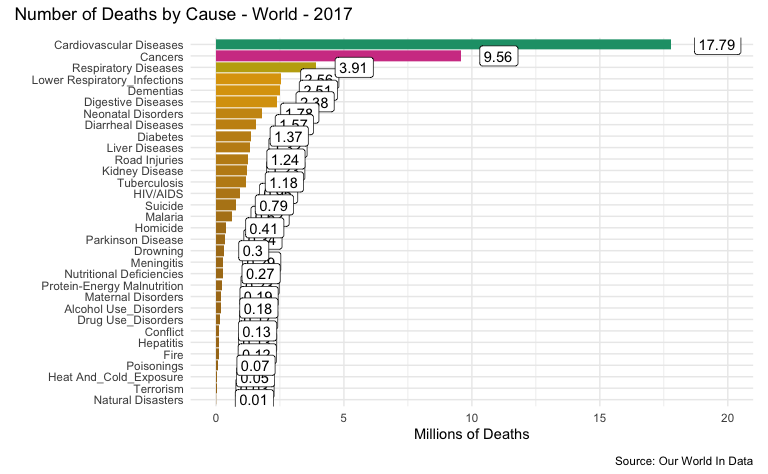

Causes of Death - Data Sets from Our World In Data
================
H. David Shea
2021-04-21

## Data sets

This work references causes of death from the Our World In Data
organization. It reference the specific section of the site
[*here*](https://ourworldindata.org/causes-of-death).

## Causes of Death

The *Global Burden of Disease* is a major global study on the causes of
death and disease published in the medical journal [*The
Lancet*](https://www.thelancet.com/gbd). These estimates of the annual
number of deaths by cause are shown in this analysis.

