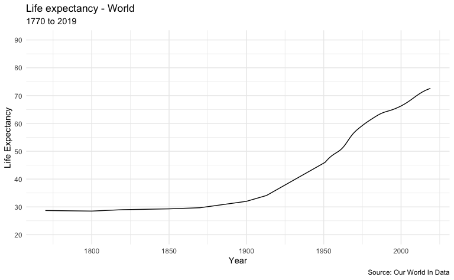
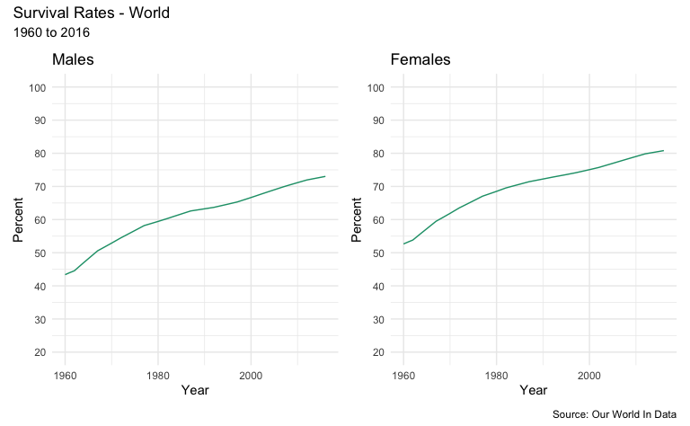

## Sections {.tabset .tabset-fade}

### Data sets

This work references data on life expectancy from the Our World In Data organization.  It reference the specific section of the site [_here_](https://ourworldindata.org/life-expectancy).


```r
life_expectancy_data <- tibble(read.csv("Data/life-expectancy.csv")) %>%
  arrange(Entity, Year)
colnames(life_expectancy_data) <- c("Entity", "Code", "Year", "Expectancy")

men_survival_to_age_65 <- tibble(read.csv("Data/men-survival-to-age-65.csv")) %>%
  arrange(Entity, Year)
colnames(men_survival_to_age_65) <- c("Entity", "Code", "Year", "Percent")

women_survival_to_age_65 <- tibble(read.csv("Data/women-survival-to-age-65.csv")) %>%
  arrange(Entity, Year)
colnames(women_survival_to_age_65) <- c("Entity", "Code", "Year", "Percent")
```

### Plotting functions

The code snippet here shows the plotting sections used in following graphics tabs.


```r
# various plot designs used in the analysis

le_plot_single <- function(data, region) {
  ggplot(data, aes(Year, Expectancy)) +
    geom_line() +
    labs(
      x = "Year", 
      y = "Life Expectancy",
      title = paste("Life expectancy", region, sep = " - "),
      subtitle = "1770 to 2019",
      caption = "Source: Our World In Data"
    ) +
    theme_minimal() +
    scale_y_continuous(limits = c(20, 90), breaks = seq(20, 90, by = 10)) + 
    theme(legend.position = "none") +
    scale_colour_brewer(palette = "Dark2")
}

sr_plot <- function(data, title_lab) {
  ggplot(data, aes(Year, Percent, color = Entity)) +
    geom_line() +
    labs(
      title = title_lab
    ) +
    theme_minimal() +
    scale_y_continuous(limits = c(20, 100), breaks = seq(20, 100, by = 10)) +
    theme(legend.position = "none") +
    scale_colour_brewer(palette = "Dark2")
}
```


### Life Expectancy

These graph shows period life expectancy at birth:  the average number of years a newborn would live if the pattern of mortality in the given year were to stay the same throughout its life.


```r
life_expectancy_data %>%
  filter(Entity == params$life_expectancy_region) %>%
  le_plot_single(params$life_expectancy_region)
```



### Survival Rates - Geography

These graphs show the share of the population that is expected to survive to the age of 65.


```r
m <- men_survival_to_age_65 %>%
  filter(Entity == params$survival_rate_geography) %>%
  sr_plot("Males")

w <- women_survival_to_age_65 %>%
  filter(Entity  == params$survival_rate_geography) %>%
  sr_plot("Females")

m + w + plot_layout(ncol = 2, guides = "collect") + 
  plot_annotation(
    title = paste("Survival Rates", params$survival_rate_geography, sep = " - "),
    subtitle = "1960 to 2016",
    caption = "Source: Our World In Data"
  )
```



### Survival Rates - Income Distribution

These graphs show the share of the population that is expected to survive to the age of 65.


```r
m <- men_survival_to_age_65 %>%
  filter(Entity == params$survival_rate_income_group) %>%
  sr_plot("Males")

w <- women_survival_to_age_65 %>%
  filter(Entity  == params$survival_rate_income_group) %>%
  sr_plot("Females")

m + w + plot_layout(ncol = 2, guides = "collect") + 
  plot_annotation(
    title = paste("Survival Rates", params$survival_rate_income_group, sep = " - "),
    subtitle = "1960 to 2016",
    caption = "Source: Our World In Data"
  )
```


