# {.tabset .tabset-fade}

## Data sets

This work references data on life expectancy and causes of death from the Our World In Data organization.  The life expectancy and survival rate graphics reference the specific section of the site [_here_](https://ourworldindata.org/life-expectancy).  The causes of death grpahics reference the specific section of the site [_here_](https://ourworldindata.org/causes-of-death).  


```r
life_expectancy_data <- tibble(read.csv("Data/life-expectancy.csv")) %>%
  arrange(Entity, Year)
colnames(life_expectancy_data) <- c("Entity", "Code", "Year", "Expectancy")

men_survival_to_age_65 <- tibble(read.csv("Data/men-survival-to-age-65.csv")) %>%
  arrange(Entity, Year)
colnames(men_survival_to_age_65) <- c("Entity", "Code", "Year", "Percent")

women_survival_to_age_65 <- tibble(read.csv("Data/women-survival-to-age-65.csv")) %>%
  arrange(Entity, Year)
colnames(women_survival_to_age_65) <- c("Entity", "Code", "Year", "Percent")

causes <- c("Executions", "Meningitis", "Lower_Respiratory_Infections",
            "Intestinal_Infectious_Diseases", "Protein-Energy_Malnutrition", "Terrorism",
            "Cardiovascular_Diseases", "Dementias", "Kidney_Disease", 
            "Respiratory_Diseases", "Liver_Diseases", "Digestive_Diseases", 
            "Hepatitis", "Cancers", "Parkinson_Disease", "Fire", "Malaria", "Drowning", 
            "Homicide", "HIV/AIDS", "Drug_Use_Disorders", "Tuberculosis", 
            "Road_Injuries", "Maternal_Disorders", "Neonatal_Disorders", "Alcohol_Use_Disorders",
            "Natural_Disasters", "Diarrheal_Diseases", "Heat_And_Cold_Exposure", 
            "Nutritional_Deficiencies", "Suicide", "Conflict", "Diabetes", "Poisonings")

causes_of_death <- tibble(read.csv("Data/annual-number-of-deaths-by-cause.csv")) %>%
  arrange(Entity, Year)
colnames(causes_of_death) <- c("Entity", "Code", "Year", all_of(causes))
causes_of_death <- causes_of_death %>% mutate(Executions = as.numeric(Executions))
```

## Plotting functions

The code snippet here shows the plotting designs used in following graphics tabs.


```r
# various plot designs used in the analysis

le_plot_single <- function(data) {
  ggplot(data, aes(Year, Expectancy)) +
    geom_line() +
    labs(
      x = "Year",
      y = "Life Expectancy",
      title = "Life expectancy",
      subtitle = "1770 to 2019",
      caption = "Source: Our World In Data"
    ) +
    theme_minimal() +
    scale_y_continuous(limits = c(20, 90), breaks = seq(20, 90, by = 10)) +
    theme(legend.position = "none") +
    scale_colour_brewer(palette = "Dark2")
}

le_plot_multi <- function(data, color_lab) {
  ggplot(data, aes(Year, Expectancy, color = Entity)) +
    geom_line() +
    labs(
      x = "Year",
      y = "Life Expectancy",
      title = "Life expectancy",
      color = color_lab,
      subtitle = "1770 to 2019",
      caption = "Source: Our World In Data"
    ) +
    theme_minimal() +
    scale_y_continuous(limits = c(20, 90), breaks = seq(20, 90, by = 10)) +
    theme(legend.position = "bottom") +
    scale_colour_brewer(palette = "Dark2")
}

sr_plot <- function(data, title_lab, color_lab) {
  ggplot(data, aes(Year, Percent, color = Entity)) +
    geom_line() +
    labs(title = title_lab,
         color = color_lab) +
    theme_minimal() +
    scale_y_continuous(limits = c(20, 100),
                       breaks = seq(20, 100, by = 10)) +
    scale_colour_brewer(palette = "Dark2")
}

cod_plot <- function(data, xlab, end_scale, increment) {
  ggplot(data, aes(Count, Cause)) +
    geom_col(aes(fill = Count)) +
    theme_minimal() +
    theme(legend.position = 'none') +
    scale_fill_distiller(palette = "Dark2") +
    geom_label(
      aes(label = Count),
      size = 3,
      hjust = -0.1,
      label.size = 0.1,
      label.padding = unit(0.1, "lines")
    ) +
    scale_x_continuous(limits = c(0, end_scale), breaks = seq(0, end_scale, by = increment)) +
    labs(x = xlab,
         y = "")
}
```

## Life Expectancy {.tabset .tabset-fade .tabset-pills}

These graphs show period life expectancy at birth:  the average number of years a newborn would live if the pattern of mortality in the given year were to stay the same throughout its life.

### The World


```r
life_expectancy_data %>%
  filter(Entity == "World") %>%
  le_plot_single()
```

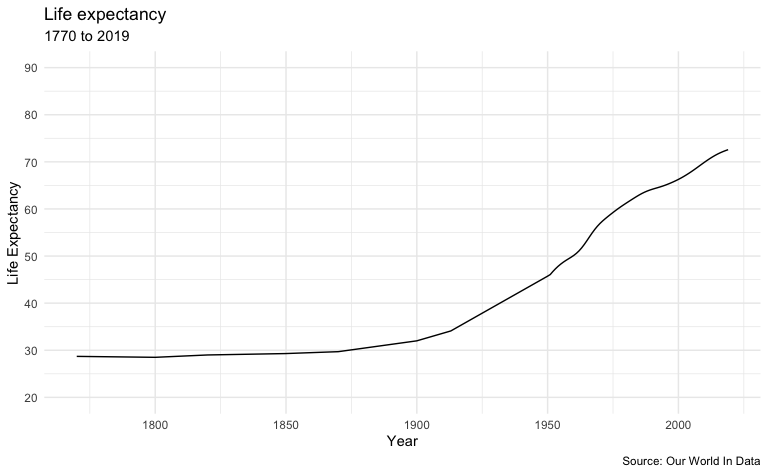

### Regions


```r
sample_list <- c("Oceania", "Europe", "Americas", "Asia", "Africa", "World")

life_expectancy_data %>%
  filter(Entity %in% sample_list) %>%
  le_plot_multi("Region")
```

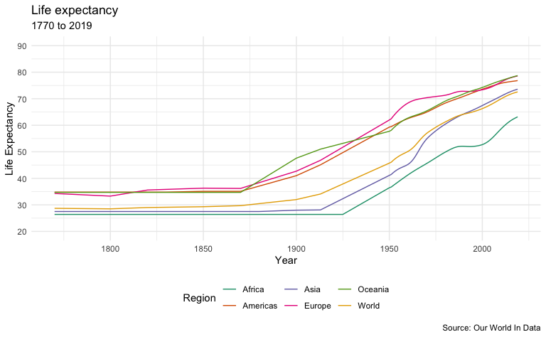

### Selected Countries


```r
sample_list <- c("Japan", "South Korea", "United Kingdom", "India", "Ethiopia", "South Africa", "United States", "World")

life_expectancy_data %>%
  filter(Entity %in% sample_list) %>%
  filter(Year >= 1865) %>%
  le_plot_multi("Country")
```

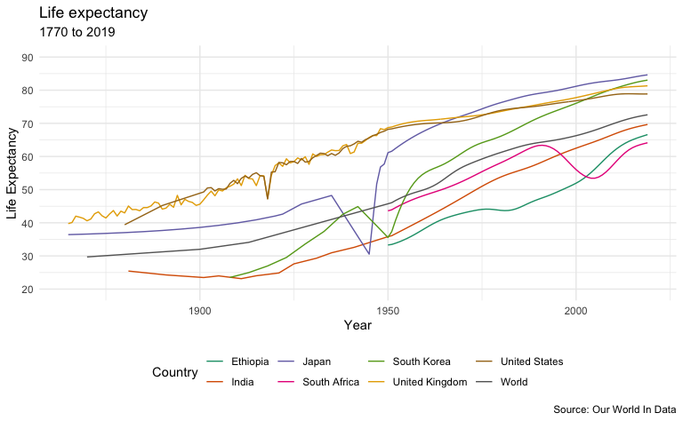

## Survival Rates {.tabset .tabset-fade .tabset-pills}

These graphs show the share of the population that is expected to survive to the age of 65.

### Selected Geographies


```r
sample_list <- c("United States", "China", "Philipines", "United Kingdom", "European Union", "India", "World")

m <- men_survival_to_age_65 %>%
  filter(Entity %in% sample_list) %>%
  sr_plot("Males", "Geography")

w <- women_survival_to_age_65 %>%
  filter(Entity %in% sample_list) %>%
  sr_plot("Females", "Geography")

m + w + plot_layout(ncol = 2, guides = "collect") + 
  plot_annotation(
    title = "Survival Rates",
    subtitle = "1960 to 2016",
    caption = "Source: Our World In Data"
  )
```

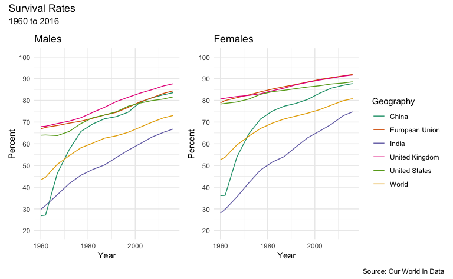

### By Income Distribution Group World-wide


```r
sample_list <- c("High income", "Middle income", "Low income", "World")

m <- men_survival_to_age_65 %>%
  filter(Entity %in% sample_list) %>%
  sr_plot("Males", "Group")

w <- women_survival_to_age_65 %>%
  filter(Entity %in% sample_list) %>%
  sr_plot("Females", "Group")

m + w + plot_layout(ncol = 2, guides = "collect") + 
  plot_annotation(
    title = "Survival Rates",
    subtitle = "1960 to 2016",
    caption = "Source: Our World In Data"
  )
```

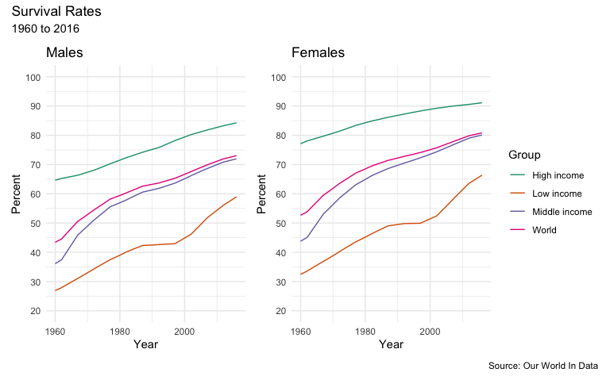

## Causes of Death {.tabset .tabset-fade .tabset-pills}

The _Global Burden of Disease_ is a major global study on the causes of death and disease published in the medical journal [_The Lancet_](https://www.thelancet.com/gbd). These estimates of the annual number of deaths by cause are shown in these graphics. 

### World


```r
latest_year <- max(causes_of_death$Year)

g <- causes_of_death %>%
  filter(Entity == "World") %>%
  filter(Year == latest_year) %>%
  pivot_longer(all_of(causes), names_to = "Cause", values_to = "Count") %>%
  filter(!is.na(Count)) %>% 
  mutate(
    Count = round(Count / 1000000, 2),
    Cause = reorder(as_factor(str_replace_all(Cause, "_", " ")), Count)
  ) %>% 
  cod_plot("Millions of Deaths", 20, 5)

g + plot_annotation(
  title = str_c("Number of Deaths by Cause - World - ", latest_year),
  caption = "Source: Our World In Data"
)
```

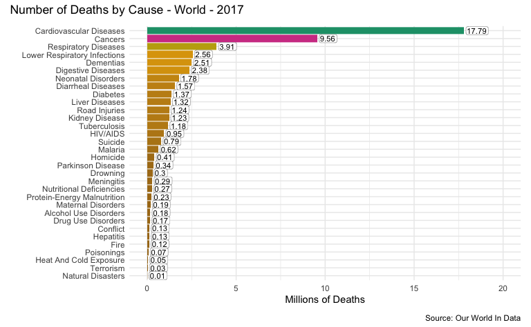

### United States


```r
latest_year <- max(causes_of_death$Year)

g <- causes_of_death %>%
  filter(Entity == "United States") %>%
  filter(Year == latest_year) %>%
  pivot_longer(all_of(causes), names_to = "Cause", values_to = "Count") %>%
  filter(!is.na(Count)) %>% 
  mutate(
    Count = round(Count / 1000, 2),
    Cause = reorder(as_factor(str_replace_all(Cause, "_", " ")), Count)
  ) %>% 
  cod_plot("Thousands of Deaths", 1000, 250)

g + plot_annotation(
  title = str_c("Number of Deaths by Cause - United States - ", latest_year),
  caption = "Source: Our World In Data"
)
```

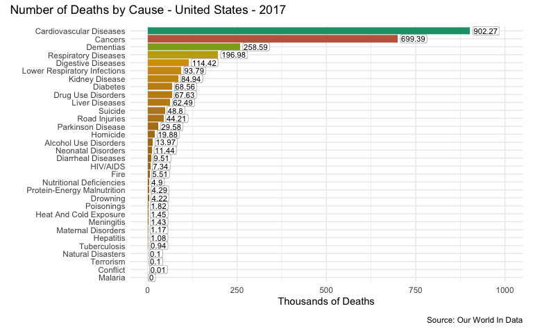

### China


```r
latest_year <- max(causes_of_death$Year)

g <- causes_of_death %>%
  filter(Entity == "China") %>%
  filter(Year == latest_year) %>%
  pivot_longer(all_of(causes), names_to = "Cause", values_to = "Count") %>%
  filter(!is.na(Count)) %>% 
  mutate(
    Count = round(Count / 1000, 2),
    Cause = reorder(as_factor(str_replace_all(Cause, "_", " ")), Count)
  ) %>% 
  cod_plot("Thousands of Deaths", 4500, 500)

g + plot_annotation(
  title = str_c("Number of Deaths by Cause - China - ", latest_year),
  caption = "Source: Our World In Data"
)
```

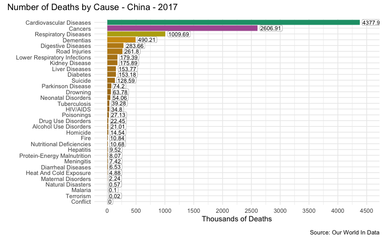

### India


```r
latest_year <- max(causes_of_death$Year)

g <- causes_of_death %>%
  filter(Entity == "India") %>%
  filter(Year == latest_year) %>%
  pivot_longer(all_of(causes), names_to = "Cause", values_to = "Count") %>%
  filter(!is.na(Count)) %>% 
  mutate(
    Count = round(Count / 1000, 2),
    Cause = reorder(as_factor(str_replace_all(Cause, "_", " ")), Count)
  ) %>% 
  cod_plot("Thousands of Deaths", 2800, 400)

g + plot_annotation(
  title = str_c("Number of Deaths by Cause - India - ", latest_year),
  caption = "Source: Our World In Data"
)
```

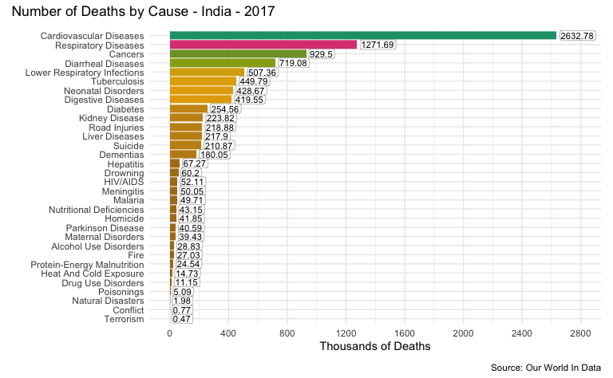

### Indonesia


```r
latest_year <- max(causes_of_death$Year)

g <- causes_of_death %>%
  filter(Entity == "Indonesia") %>%
  filter(Year == latest_year) %>%
  pivot_longer(all_of(causes), names_to = "Cause", values_to = "Count") %>%
  filter(!is.na(Count)) %>% 
  mutate(
    Count = round(Count / 1000, 2),
    Cause = reorder(as_factor(str_replace_all(Cause, "_", " ")), Count)
  ) %>% 
  cod_plot("Thousands of Deaths", 650, 50)

g + plot_annotation(
  title = str_c("Number of Deaths by Cause - Indonesia - ", latest_year),
  caption = "Source: Our World In Data"
)
```

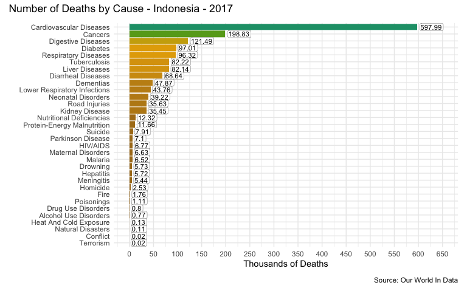

### United Kingdom


```r
latest_year <- max(causes_of_death$Year)

g <- causes_of_death %>%
  filter(Entity == "United Kingdom") %>%
  filter(Year == latest_year) %>%
  pivot_longer(all_of(causes), names_to = "Cause", values_to = "Count") %>%
  filter(!is.na(Count)) %>% 
  mutate(
    Count = round(Count / 1000, 2),
    Cause = reorder(as_factor(str_replace_all(Cause, "_", " ")), Count)
  ) %>% 
  cod_plot("Thousands of Deaths", 200, 25)

g + plot_annotation(
  title = str_c("Number of Deaths by Cause - United Kingdom - ", latest_year),
  caption = "Source: Our World In Data"
)
```

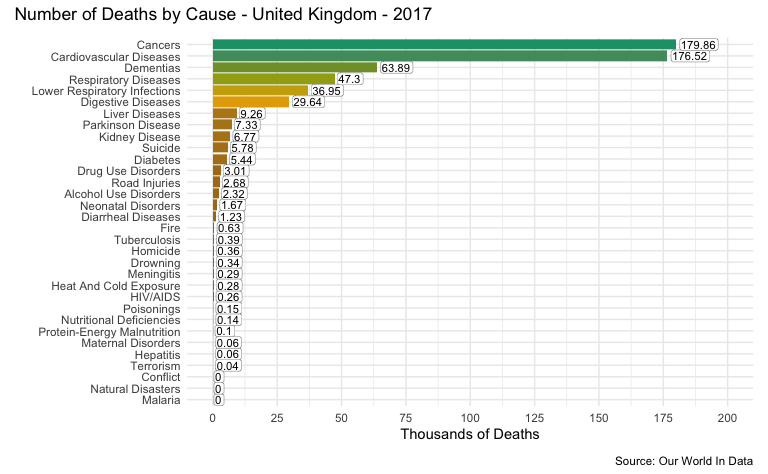

### France


```r
latest_year <- max(causes_of_death$Year)

g <- causes_of_death %>%
  filter(Entity == "France") %>%
  filter(Year == latest_year) %>%
  pivot_longer(all_of(causes), names_to = "Cause", values_to = "Count") %>%
  filter(!is.na(Count)) %>% 
  mutate(
    Count = round(Count / 1000, 2),
    Cause = reorder(as_factor(str_replace_all(Cause, "_", " ")), Count)
  ) %>% 
  cod_plot("Thousands of Deaths", 200, 25)

g + plot_annotation(
  title = str_c("Number of Deaths by Cause - France - ", latest_year),
  caption = "Source: Our World In Data"
)
```

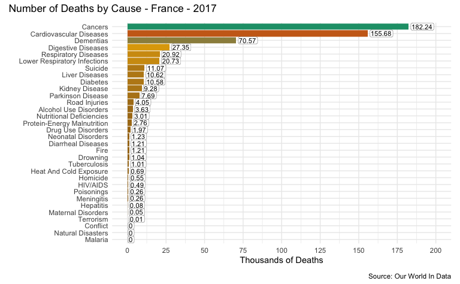

### Japan


```r
latest_year <- max(causes_of_death$Year)

g <- causes_of_death %>%
  filter(Entity == "Japan") %>%
  filter(Year == latest_year) %>%
  pivot_longer(all_of(causes), names_to = "Cause", values_to = "Count") %>%
  filter(!is.na(Count)) %>% 
  mutate(
    Count = round(Count / 1000, 2),
    Cause = reorder(as_factor(str_replace_all(Cause, "_", " ")), Count)
  ) %>% 
  cod_plot("Thousands of Deaths", 500, 100)

g + plot_annotation(
  title = str_c("Number of Deaths by Cause - Japan - ", latest_year),
  caption = "Source: Our World In Data"
)
```

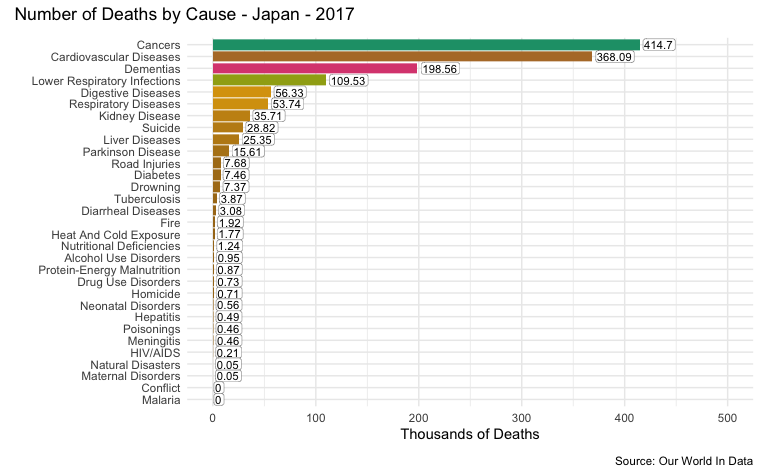

### Russia


```r
latest_year <- max(causes_of_death$Year)

g <- causes_of_death %>%
  filter(Entity == "Russia") %>%
  filter(Year == latest_year) %>%
  pivot_longer(all_of(causes), names_to = "Cause", values_to = "Count") %>%
  filter(!is.na(Count)) %>% 
  mutate(
    Count = round(Count / 1000, 2),
    Cause = reorder(as_factor(str_replace_all(Cause, "_", " ")), Count)
  ) %>% 
  cod_plot("Thousands of Deaths", 1200, 300)

g + plot_annotation(
  title = str_c("Number of Deaths by Cause - Russia - ", latest_year),
  caption = "Source: Our World In Data"
)
```

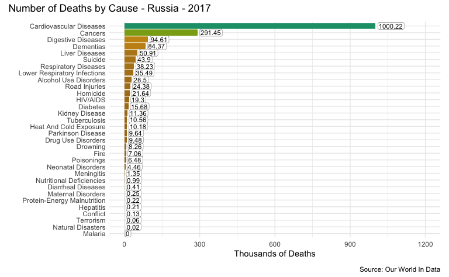

### Brazil


```r
latest_year <- max(causes_of_death$Year)

g <- causes_of_death %>%
  filter(Entity == "Brazil") %>%
  filter(Year == latest_year) %>%
  pivot_longer(all_of(causes), names_to = "Cause", values_to = "Count") %>%
  filter(!is.na(Count)) %>% 
  mutate(
    Count = round(Count / 1000, 2),
    Cause = reorder(as_factor(str_replace_all(Cause, "_", " ")), Count)
  ) %>% 
  cod_plot("Thousands of Deaths", 400, 100)

g + plot_annotation(
  title = str_c("Number of Deaths by Cause - Brazil - ", latest_year),
  caption = "Source: Our World In Data"
)
```

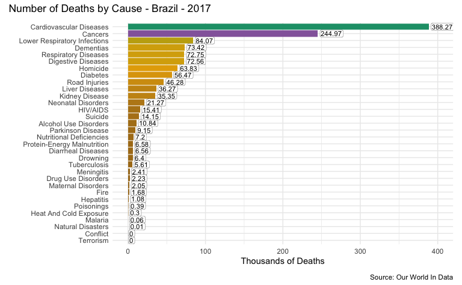
