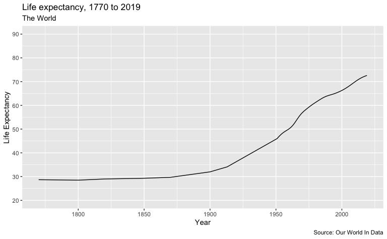
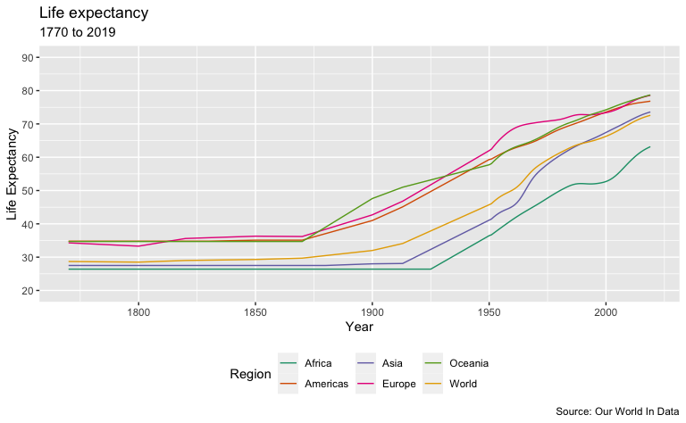
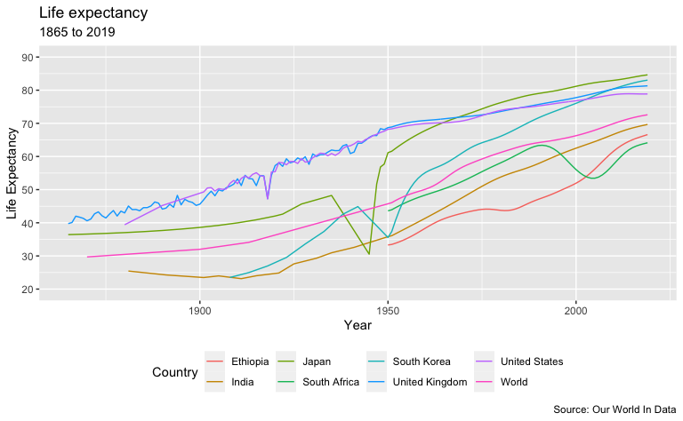
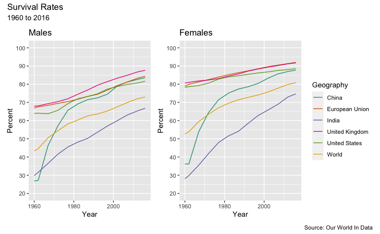
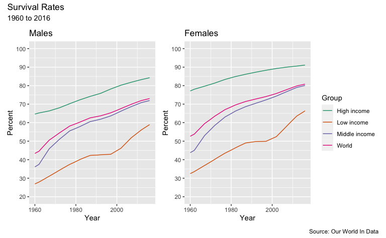

Life Expectancy Graphics - Data Sets from Our World In Data
================
H. David Shea
2021-04-19

## Data sets

This work references data on life expectancy from the Our World In Data
organization. It reference the specific section of the site
[*here*](https://ourworldindata.org/life-expectancy).

## Life Expectancy

These graphs show period life expectancy at birth: the average number of
years a newborn would live if the pattern of mortality in the given year
were to stay the same throughout its life.

### The World

### Regions

### Selected Countries

## Survival Rates

These graphs show the share of the population that is expected to
survive to the age of 65.

### Selected Geographies

### By Income Distribution Group Globally

